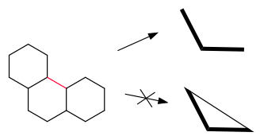
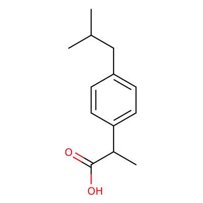
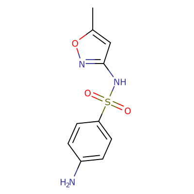
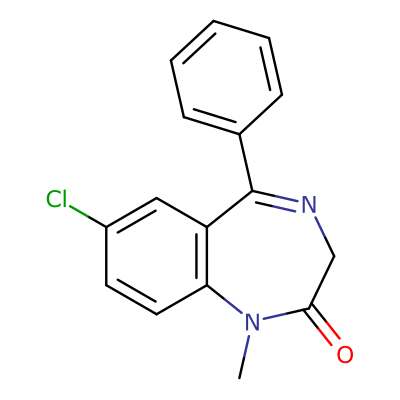
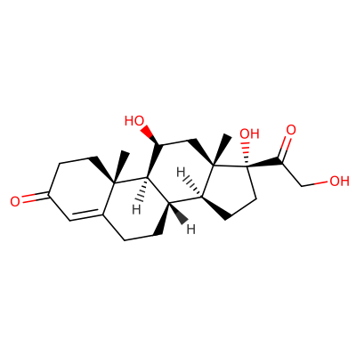
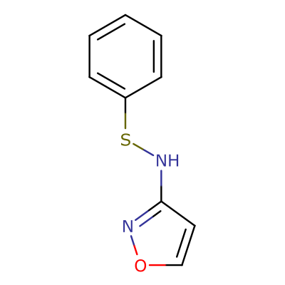
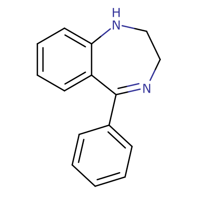

# The Scaffold Hierarchy

The default scaffold hierarchy used in the Scaffold Visualizer forms a rooted tree with a single hierarchy root (level 0), eight levels of scaffolds (numbered 1-8), and molecules as leaves (level 9). That means that each molecule is mapped to a sequence of exactly eight scaffolds, one for each level. Each molecule and scaffold also has one uniquely defined parent.

At the bottom of the hierarchy, the scaffolds are inspired by molecular frameworks by [Bemis and Murcko, 1996]. The middle of the is defined based on ring topologies as described by [Pollock et al., 2008]. The top levels then further abstract the idea of ring topologies.

In the following text the individual levels are descibed. For easier understanding of the transformations, pictures of four existing drugs together with theirs scaffolds on every level are included bellow the text.

## Hierarchy Levels

### Level 8: Rings with Linkers Stereo

The bottom level contains all ring systems and liker atoms. Stereo information is conserved at this level. To describe the scaffold derivation process, level 8 scaffolds are obtained from a molecule by removal of sidechains, performing standard aromatization, neutralizing charge, removing explicit hydrogens and radicals, and discarding element isotope information.

### Level 7: Rings with Linkers

The seventh level is identical to the bottom level except for that all the stereo information has been discarded.

### Level 6: Murcko Rings with Linkers

This level corresponds to the Murcko graph frameworks – i.e. the scaffold is a skeleton of the original molecule with all of the chemical information discarded, atom connectivity being the only thing left. To convert a level 7 scaffold to a level 6 scaffold, all elements are replaced by carbon and all bonds are converted to single.

### Level 5: Murcko Rings

Another level is obtained by deleting linker atoms of degree 2. That means that only leave branching linker atoms are left and all linker paths are replaced by a single edge. In this step, for the first time, the size (number of vertices) of the scaffold might be lesser than the size (number of atoms) of the original molecule framework.

### Level 4: Oprea

The Oprea scaffolds are obtained by performing similar contraction on ring atoms. In this step, all remaining vertices of degree 2 are removed, performing edge merging operation on them. The only exception being when both vertice's 
neighbors are connected (i.e. the cycle is minimal – a triangle). The resulting scaffold is a minimum cycle topological representation of the original molecule.

### Level 3: Ring Connectivity Extended

Up to level 4, every vertex of a scaffold graph corresponded to an atom in the original molecule. However, on levels 2 and 3 the vertices do not represent to atoms but entire rings. Level 3 scaffolds are created from Oprea scaffolds in two steps.

First, the molecule is decomposed to rings, using a CSSR (Complete Set of 
Smallest Rings) algorithm. Each such ring is then represented by one vertex in the new scaffold.

Second, the rings that were connected in the original graph are connected in the new scaffold. Two types of connectivity are distinguished:

1. Strong connectivity – when the two rings share an edge in the original graph.

2. Weak connectivity – when the two rings share a vertex in the original graph or when they are connected by an edge which is not a part of any ring (a “linker edge”) or when it is connected by a path formed by linker edges.

The rules for strong and weak connectivity try to reflect whether the connection of the original rings is rigid or flexible. Rings sharing an edge – fused rings – are considered to be rigid. Other connections are considered flexible/weak.

The restriction to linker edges is to prevent unexpected superfluous edges in the resulting graph. 
The following image illustrates why ring edges have to be excluded.

The red ring bond is excluded when calculating a ring connectivity scaffold; including the edge would form a triangle instead of a linear path.

In the scaffold molecule representation, strong connectivity is modeled as bonds of order two (double bonds) and weak 
connectivity as bonds of order one (single bonds). In a visual representation, strong connectivity is represented by bold bonds and weak connectivity by standard bonds.

### Level 2: Ring Connectivity

A simplified variant of the ring connectivity scaffold removes the distinction between the strong and weak connectivity, making all bonds single/standard, and distinguishing only between connected and not connected rings, with the same exceptions as on the previous level.

### Level 1: Ring Count

On the top level, all molecules are representedsimply by their ring count. More precisely, that is defined as the number of vertices of the ring connectivity scaffolds at levels 2 and 3. Which is in turn equal to the number of rings in the CSSR decomposition of the Murcko scaffold or the original molecule.

### Level 0: Root

A single node at level 0 serves as the root of the scaffold 
hierarchy.

## Example

The following table gives an example of four molecules together with their scaffolds on every level. The molecules pictured are four known drugs – ibuprofen, sulfamethoxazole, diazepam, and hydrocortisone. The molecule data have been obtained from [DrugBank], record ids DB01050, DB01015, DB00829, and DB00741 respectively.

|Level|Ibuprofen|Sulfamethoxazole|Diazepam|Hydrocortisone|
|---|---|---|---|---|
|native|||||
|8|||||
|7|||||
|6|||||
|5|||||
|4|||||
|3|||||
|2|||||
|1|||||

[Bemis and Murcko, 1996]: http://dx.doi.org/10.1021/jm9602928
[Pollock et al., 2008]: http://dx.doi.org/10.1021/ci7003412
[DrugBank]: http://www.drugbank.ca/