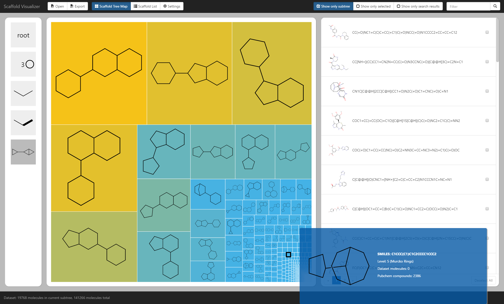

# Visualizer User Guide

The visualizer is a server-client application which enables to interactively explore molecule data sets based on the scaffold hierarchy. The visualizer allows users to:

* browse the scaffold hierarchy as a zoomable tree map - explore molecular scaffolds in the underlying PubChem Compound database and their frequency;
* import an existing data set in all common cheminformatics file formats (SDF/Molfile, SMILES, InChI, CML, and more);
* display imported compounds in the tree map;
* colorize the tree map according to scaffold frequency in user data set, in PubChem, frequency in user data set relative to frequency in PubChem;
* change the used color gradient;
* base tree map element sizes either or frequency in data set or on frequency in PubChem;
* apply logarithmic transformation to the sizes or the color source values;
* select molecules by scaffold or directly;
* search for molecules;
* filter molecules based on the selection, the search filter and the current subtree;
* browse the filtered molecules in a pageable list;
* display scaffolds as a list instead of a tree map;
* sort the scaffold list by frequency in data set, in PubChem, or lexicographically;
* export the molecules based on the selection, search filter and current subtree;
* export scaffolds on the current level;
* save current data set including the computed scaffolds and selection;
* bookmark or link the current position in the scaffold hierarchy.

## User Interface

The main screen of the visualizer is show in the following figure:

The interface consists of several basic components - in the center of the image, from left to right, the breadcrumb navigation, the scaffold box and the molecule box. Above and bellow that are the header and the footer. In the lower right corner is shown the tooltip. Not shown in the picture are three forms - Load data set form, Export data form and Settings form. We now describe the components one by one:

#### Header
The header toolbar at the top of the screen provides buttons opening the dialogues for import or export of data. Next to it are two buttons which switch between a tree map visualization of scaffolds and a scaffold list. Accompanying them is a third button which provides additional settings for the scaffold box. At the right of the header are three buttons enabling and disabling three filters to be applied to molecules in the molecule box. Last is the input box to enter search queries for the molecule box.

#### Breadcrumb
At the left of the screen is the breadcrumb navigation bar which displays the current position in the hierarchy. The bottom most, and slightly darker, scaffold in the breadcrumb is the currently selected scaffold - i.e. the scaffold whose children are shown in the scaffold box next to bread crumb. The unique id of this current scaffold is shown in the browser's address and can be used to revisit it later. The current scaffold is also used to filter molecules in the molecule box are filtered (as long as the “show only subtree” filter is active). Above the current scaffolds are all his ancestors, up to the hierarchy root. Clicking them selects them as the current scaffold. Hovering the mouse above any of the scaffolds shows the tooltip.

#### Scaffold Box
The scaffold box show the children of the current parent scaffold. These children scaffolds can be shown either as the tree map (the default) or the scaffold list. Both can be used to navigate the hierarchy up and down and show information about the scaffolds and the current dataset. But the form is different in both cases, so they will be described separately.

#### Tree Map
The scaffold tree map is the main component around which the visualizer is built. It provides a hierarchical visualization of user datasets on the background of Pubchem background database. The map displays a set of scaffolds, each scaffold represented by a rectangle. In the rectangle is shown a picture of the scaffold. The rectangle's area is by default based on the relative frequency of the scaffold in the background hierarchy; the color is based on the frequency of the scaffold on the user data set. Sources of the area and color can be changed in the Settings form. Optionally, a logarithmic transformation can be applied. And the color gradient can be replaced by a different one. Shift-clicking a scaffold selects or deselects corresponding molecules. On mouse wheel scrolling the tree map is zoomed in (navigating to the scaffold under the mouse pointer) or zoomed out (navigating to the current scaffold's parent). Double-clicking zooms in as well. Moreover, upon hovering the mouse above a scaffold the tooltip is shown providing detailed information.

#### Scaffold List
The functionality of the scaffold list is analogous to that one of the scaffold tree map. The form is, however, different. The scaffolds are shown as a list, sorted lexicographically or by their frequency in the user data set or in the background hierarchy. Each item in the list contains a small image of the scaffold, its name, level in the hierarchy and the number of molecules in the user data set and in the background hierarchy, that correspond to the particular scaffold. A button for “zooming in” the scaffold is present. And clicking the scaffold selects the corresponding molecules, same as in the tree map.

#### Tooltip
An important part of the scaffold tree map is the tooltip. It provides the same information as the scaffold list, together with a larger picture. A picture-only tooltip is also available in the scaffold list and the molecule list.

#### Molecule List
The molecule list is empty until a user data set is loaded. After that, it shows the list of loaded molecules. By default, the list is restricted to the molecules in the current subtree - i.e. the molecules that correspond to the current scaffold. The list can also be restricted to show only the selected molecules or to only show search results - as long as a search query is entered. All the three filters can be toggled using the buttons at the right side of the header. The search query can be entered in the same place. For each molecule a picture is shown, together with its SMILES string and its name and comment, as long as they were present in the input. Clicking a molecule selects it. The molecules are shown by pages consisting of 50 items. The total number of pages is not precalculated to avoid evaluation of the filters on huge data sets - i.e. only the next page and the preceding pages are available in the pager.

#### Footer
The footer shows the size of the loaded data set and the size of the current subtree. If any molecules are selected, it also shows the number of selected molecules in both - the data set and the current subtree.

#### Export Form
The Export form is accessible via the “Export” button in the toolbar. It allows exporting molecules or scaffolds in standard SMILES format or exporting the whole dataset in a custom binary format.

#### Load Dataset Form
The Load Dataset form is accessible clicking the “Open” button in the toolbar. It allows selecting a file containing user molecules to be loaded; the file is then submitted to the server. The file can be in arbitrary format which is supported by the ChemAxon JChem cheminformatics toolkit, or it can be the binary dataset obtained through the Export form, which is considerably faster to load (as the scaffolds are already precomputed).

#### Settings Form
The Settings form, also accessible via the the header toolbar, offers a range of settings for the Scaffold Box.

## Requirements and Limits

The Scaffold Visualizer has been confirmed to work under Google Chrome (version 51) and Microsoft Internet Explorer (version 11). Most of the development has been done using Google Chrome so that is the preferable option which should provide the best experience. On top of that, 64-bit version of Google Chrome has a higher memory limit than the 32-bit version and allows for larger data sets to be loaded.

Performance-wise a lot of attention has been devoted to making the application able to handle larger data sets - that is especially important considering the size of data sets used in context of high throughput screening methods. The exact size of data set that can be loaded depends on the used browsers and even on the data itself. The most significant limitation is the amount of memory available to the browser JavaScript interpreter. Using the aforementioned Google Chrome browser, version 51, 64-bit, a dataset of 500 thousand drug-like molecules from ZINC database has been opened and the application performed reasonably well.

However, the data sets are quite slow to load. That is being determined by the speed of the initial processing at the server. On a 4-core 4-GHz CPU, the server is able to process about 1000 molecules per second - meaning that the 500 thousand molecules large dataset takes almost 10 minutes to load. The processing time is linear to the size of the input.

To reduce the loading time, it is possible to save a processed dataset to a file using custom binary export format. The molecules are then saved together with their generated scaffolds and such data set can be opened without even being sent to the server - reducing loading time from minutes to seconds for the largest data sets. However, this approach only helps when a data set is used repeatedly - the first processing always takes the full time.